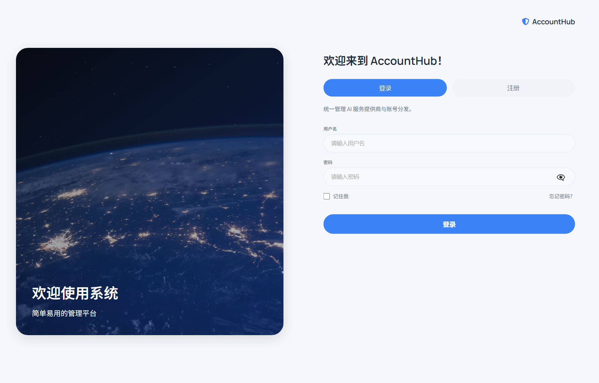
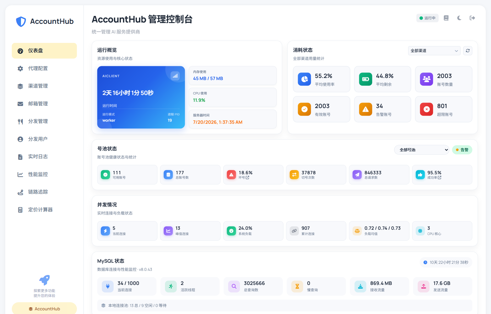
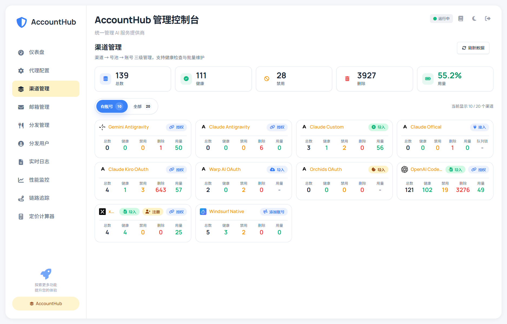
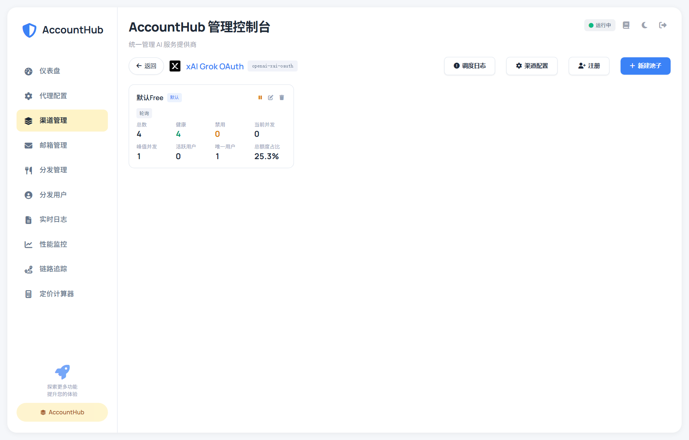
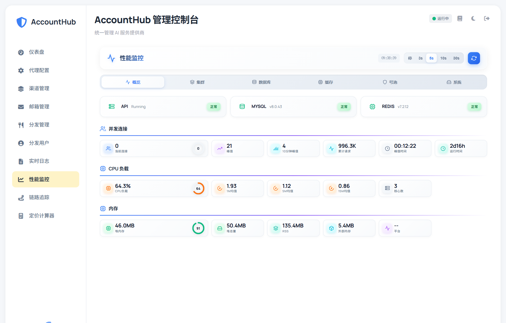
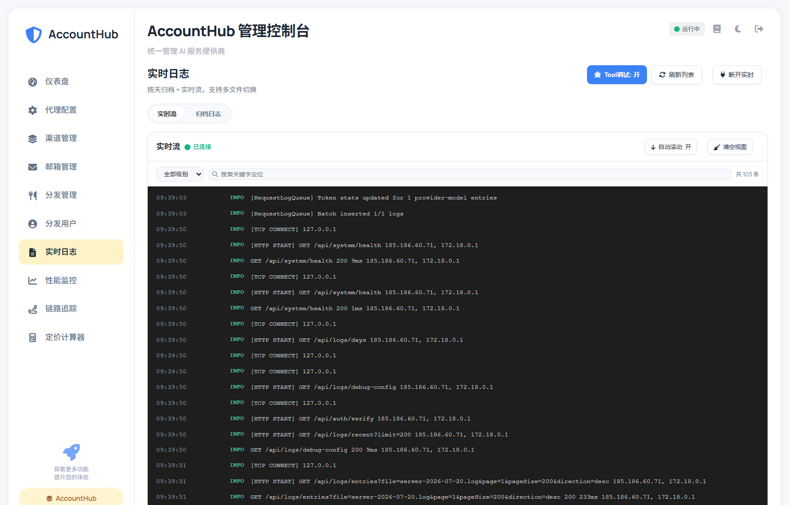

<div align="center">


# AccountHub

**Multi-account OAuth pool & protocol gateway for AI providers**

[](LICENSE)
[](https://nodejs.org)
[](https://www.docker.com)

[Features](#features) · [Architecture](#architecture) · [Quick Start](#quick-start) · [One-click install](#one-click-install) · [Docker](#docker) · [Research use](#research-use--disclaimer)

</div>

---

## What is AccountHub?

AccountHub is a **control plane for AI provider accounts**:

- manage OAuth / API credentials across many accounts
- pool, route, and health-check them
- expose **OpenAI-compatible** and **Anthropic-compatible** endpoints
- normalize usage (including cache tokens) for upstream gateways

It is **not** a chat UI and **not** a user-billing panel.  
It sits **upstream of** API gateways (for example NewAPI): AccountHub owns accounts & protocols; the gateway owns end users & billing.

> **Independent project.** AccountHub is not affiliated with, branded as, or a continuation of any project named AIClient. That is a separate codebase and product line.
>
> **Research / self-host oriented.** Provided for learning, research, and authorized experiments. You must comply with provider Terms of Service and law. See [NOTICE.md](NOTICE.md), [docs/public/RESEARCH_USE.md](docs/public/RESEARCH_USE.md), and [docs/public/PRIVACY.md](docs/public/PRIVACY.md).

---


## Screenshots

<p align="center">
  
  
</p>
<p align="center">
  
  
</p>
<p align="center">
  
  
</p>

## Features

- **Account pools** — health checks, cooldowns, sticky sessions, concurrency limits
- **Multi-provider** — OpenAI-family, Anthropic-compatible, Gemini-family, xAI Grok, and more
- **OAuth lifecycle** — import, refresh, lock, multi-account rotation
- **Protocol bridge** — Claude Messages ↔ OpenAI Chat / Responses ↔ provider-native APIs
- **Channel config** — default models, routing, provider-level switches (e.g. Grok API vs Build)
- **Ops console** — React admin for pools, accounts, logs, and usage
- **Database-backed** — MySQL for credentials, pools, and request stats

---

## Architecture

```
                    ┌──────────────────────┐
  Clients / Gateways│  OpenAI / Anthropic  │
  (SDK, NewAPI, …)  │  compatible HTTP     │
                    └──────────┬───────────┘
                               │
                    ┌──────────▼───────────┐
                    │     AccountHub       │
                    │  pool · route · auth │
                    │  protocol convert    │
                    └──────────┬───────────┘
               ┌───────────────┼───────────────┐
               ▼               ▼               ▼
          Provider A      Provider B      Provider C
          (OAuth pool)    (OAuth pool)    (API keys)
```

| Layer | Responsibility |
|-------|----------------|
| Frontend | Admin console (React) |
| Backend | Gateway, pools, OAuth, converters |
| MySQL | Accounts, pools, channel config, request logs |
| Redis (optional) | Sticky sessions, concurrency, sharding |

---


## One-click install

> Requires Docker Compose v2. By running the installer you acknowledge the research-use notice.

**Linux / macOS**

```bash
git clone https://github.com/lmk1010/Accounthub.git
cd Accounthub
chmod +x scripts/install.sh
./scripts/install.sh
```

**Windows**

```bat
git clone https://github.com/lmk1010/Accounthub.git
cd Accounthub
scripts\install.bat
```

Then open **http://localhost:13001** (API on **http://localhost:13000**).

Full walkthrough: [docs/public/QUICKSTART.md](docs/public/QUICKSTART.md)

---
## Quick Start

### Prerequisites

- Node.js ≥ 18
- MySQL 8.0
- Docker (optional)

### Development

**Backend**

```bash
cd backend
npm install
npm run start:dev
```

**Frontend**

```bash
cd frontend
npm install
npm run dev
```

- Frontend: `http://localhost:5173`
- Backend API: `http://localhost:3000` (or your configured port)

### Configuration

Runtime configuration is stored mainly in MySQL:

- provider accounts & OAuth credentials
- pool routing / health policy
- channel defaults (models, path switches)
- system settings (ports, proxy, callback hosts)

---

## Docker

```bash
docker pull YOUR_DOCKERHUB/accounthub-backend:latest
docker pull YOUR_DOCKERHUB/accounthub-frontend:latest
```

**Backend**

```bash
docker run -d \
  --name accounthub-backend \
  --restart unless-stopped \
  -p 13000:3000 \
  -v /opt/AccountHub/configs:/app/configs \
  -v /opt/AccountHub/logs:/app/logs \
  -e NODE_ENV=production \
  YOUR_DOCKERHUB/accounthub-backend:latest
```

**Frontend**

```bash
docker run -d \
  --name accounthub-frontend \
  --restart unless-stopped \
  -p 13001:80 \
  YOUR_DOCKERHUB/accounthub-frontend:latest
```

Admin UI: `http://localhost:13001`

---

## Repository layout

```
AccountHub/
├── backend/                 # API gateway, pools, OAuth, converters
├── frontend/                # React admin console
├── scripts/install.sh       # One-click Docker installer (Linux/macOS)
├── scripts/install.bat      # One-click Docker installer (Windows)
├── docker-compose.yml       # Local MySQL + Redis + app stack
├── docs/public/             # Quick start, research use, privacy
├── NOTICE.md                # Trademarks & research notice
└── README.md
```

---

## Relationship to other software

| Name | Relationship |
|------|----------------|
| **AccountHub** | This repository — account pool + protocol gateway |
| API gateways (e.g. NewAPI) | Optional **downstream** consumers; not a fork of them |
| AI vendors (OpenAI, Anthropic, Google, xAI, …) | Upstream providers; trademarks belong to them |
| **AIClient** (any similarly named tool) | **Separate project** — no shared brand, no affiliation |

---

## Research use & disclaimer

AccountHub is distributed for **learning, research, and authorized self-hosted experiments**.

- [NOTICE.md](NOTICE.md) — trademarks, independence, experimental adapters  
- [docs/public/RESEARCH_USE.md](docs/public/RESEARCH_USE.md) — acceptable use / your responsibilities  
- [docs/public/PRIVACY.md](docs/public/PRIVACY.md) — self-host privacy guidance  
- [SECURITY.md](SECURITY.md) — vulnerability reporting  


- AccountHub is infrastructure software. **You** must comply with each provider’s Terms of Service and applicable law.
- Provider names and logos are trademarks of their respective owners; use here is for identification only.
- This project does **not** ship vendor accounts, paid quotas, or any guarantee of third-party API access.
- Experimental or unofficial provider adapters may break without notice; prefer official APIs where possible.

---

## License

MIT — see [LICENSE](LICENSE).

---

<div align="center">
  <sub>AccountHub · account pool control plane for AI providers</sub><br/>
  <sub>For research & authorized self-hosting · <a href="NOTICE.md">Notice</a> · <a href="docs/public/RESEARCH_USE.md">Research use</a> · <a href="docs/public/PRIVACY.md">Privacy</a></sub>
</div>
